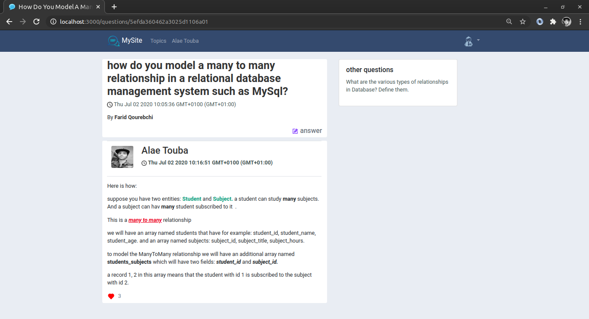
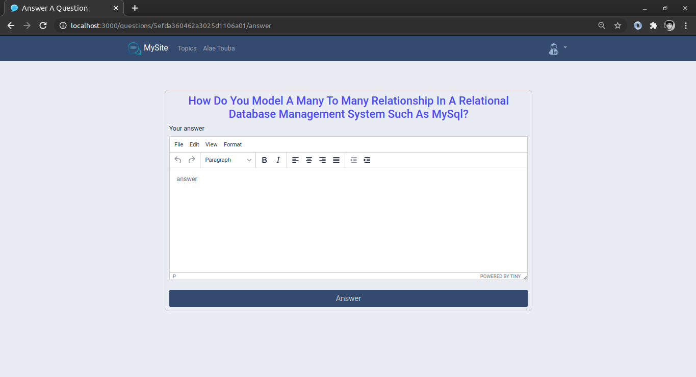
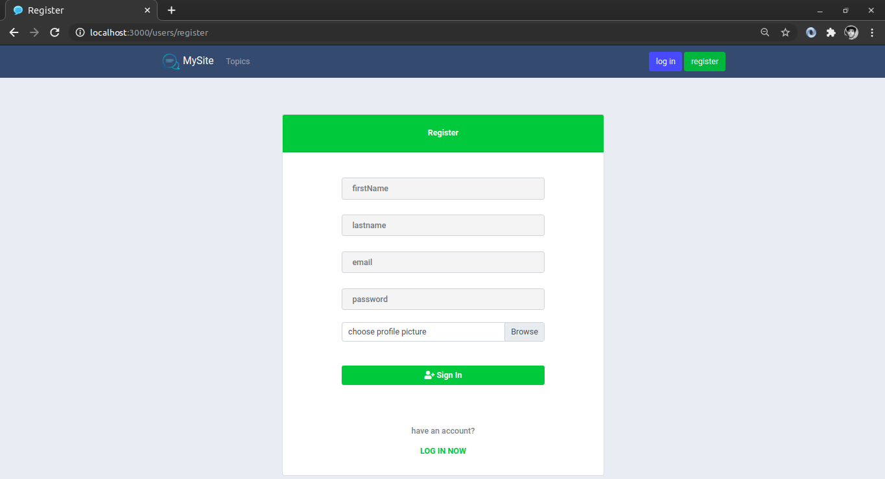

# Table of content

-   **[About](#about)**
-   **[Entity Relationship Diagram](#entity-relationship-diagram)**
-   **[Modeling Data - Relationships Between The 4 Models](#modeling-data-relationships-between-the-4-models)**
-   **[Mongoose Schemas](#mongoose-schemas)**
-   **[API](#api)**
-   **[Test The App](#test-the-app)**
-   **[How It Looks Like](#how-it-looks-like)**

<a name="about"></a>

# About

This is a _question-and-answer_ social network website where users can:

-   create and follow different topics
-   ask questions in these topics
-   answer questions and like/dislike answers.
-   track other users in the website to see what questions someone asked, what answers he/she gave, which topics they follow, ...etc

<a name="entity-relationship-diagram"></a>

# Entity Relationship Diagram

here is the _ERD_ for this app:


<a name="modeling-data-relationships-between-the-4-models"></a>

# Modeling Data - Relationships Between The 4 Models

A user has many topics (create)\
A topic belongs to one user \
=> one to many

A user has many questions (ask) \
A question belongs to one user \
=> one to many

A user has many answers (answer) \
An answer belongs to one user \
=> one to many

A topic has many questions \
A question belongs to one topic \
=> one to many

A question has many answers \
An answer belongs to one question \
=> one to many

A user can follow many topics (follow) \
A topic has many followers \
=> many to many

An answer has many users who like it \
A user can like many answers \
=> many to many

<a name="mongoose-schemas"></a>

# Mongoose Schemas

I use two way (parent & child) referencing for all relationships:

```
User{
    _id             : ObjectId
    firstName       : String
    lastName        : String
    email           : String
    password        : String
    imageName       : String
    registrationDate: Date
    topics          : Topic[]       //we store the topics ids
    questions       : Question[]    //same
    answers         : Answer[]
    topicsFollowed  : Topic[]
    answersLiked    : Answer[]
}
```

```
Topic{
    _id             : ObjectId
    name            : String
    description     : String
    imageName       : String
    creationDate    : Date
    user            : User
    questions       : Question[]
    usersFollowers  : User[]
}
```

```
Question{
    _id             : ObjectId
    content         : String
    creationDate    : Date
    topic           : Topic
    user            : User
    answers         : Answer[]
}
```

```
Answers{
    _id             : ObjectId
    content         : String
    creationDate    : Date
    user            : User
    question        : Question
    usersWhoLike    : User[]
}
```

---

<a name="api"></a>

# API

```
GET    /users
GET    /users/:id
GET    /users/:id/:content (content == questions | answers | topics | topics-followed)
GET    /users/register
GET    /users/login
POST   /users/register
POST   /users/login
DELETE /users/logout
```

```
GET    /topics
GET    /topics/:id
GET    /topics/create
POST   /topics/create
GET    /topics/:id/question
POST   /topics/:id/question
DELETE /topics/:id              //NIY
PATCH  /topics/:id              //NIY
POST   /topics/follow-infollow  //NIY
```

```
GET    /questions/:id
GET    /questions/:id/answer
POST   /questions/:id/answer
DELETE /questions/:id           //NIY
PATH   /questions/:id           //NIY
```

```
POST   /answers/like-unlike
GET    /answers/:id             //NIY
DELETE /answers/:id             //NIY
PATH   /answers/:id             //NIY
```

(NIY <=> Not Implemented Yet )

<a name="test-the-app"></a>

# Test The App

```
    npm install
    npm startdev
```

go to `localhost:3000`

<a name="how-it-looks-like"></a>

# How It Looks Like








